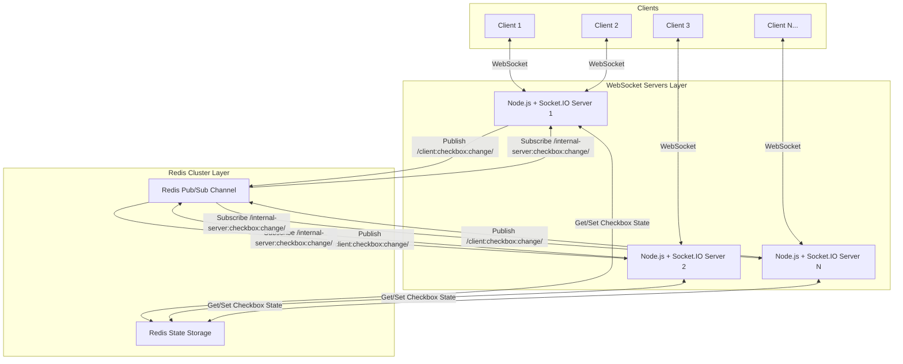

# 10,000 Checkboxes

A massively multiplayer, real-time collaborative web application where thousands of users can simultaneously check and uncheck up to 10,000 checkboxes. Built with Node.js, Express, Socket.IO, and Redis (Valkey).

## 🚀 Overview

This project demonstrates a highly scalable, real-time WebSocket architecture. When a user toggles a checkbox, the state is immediately broadcasted to all other connected clients, giving a seamless, collaborative "multiplayer" feel. 

To prevent the Node.js server from becoming a bottleneck, the application state and message brokering are completely decoupled from the WebSocket servers and handed off to **Redis**. 

## 🏗️ Architecture



## 🔄 How it Works

1. **Initial Load**: When a user visits the site, the frontend fetches the current state of all 10,000 checkboxes via a REST API endpoint (`/checkboxes`).
2. **WebSocket Connection**: The client establishes a persistent Socket.IO connection to one of the available Node.js servers.
3. **Event Emitting**: When a client checks a box, an event (`client:checkbox:change`) is emitted to their connected Node.js server.
4. **State Management**: The Node.js server intercepts the event, updates the central state array stored in Redis (`checkbox-state`), and immediately publishes the event payload to a Redis Pub/Sub channel.
5. **Broadcasting**: All running Node.js servers are subscribed to this Redis Pub/Sub channel. Once they receive the event from Redis, they broadcast the change (`server:checkbox:change`) down to all of their directly connected clients.

## 📈 Extreme Scalability

This architecture is designed for massive horizontal scaling.

By placing **Redis in the middle** as the source of truth and the message broker, the WebSocket servers become completely stateless. 
- **Linear Server Scaling**: You can spin up 10, 100, or 1,000 independent Node.js WebSocket servers behind a load balancer.
- **Exponential User Scaling**: If you have 1,000 WebSocket servers, and each server can efficiently handle 1,000 concurrent socket connections, your application can easily scale to **1,000,000 concurrent users** interacting in real-time.
- **Infinite Redis Scaling**: If the pub/sub throughput or memory limits of a single Redis instance become a bottleneck, Redis can be transitioned into a **Redis Cluster**. This shards the data and pub/sub channels across multiple physical nodes, allowing the system to scale almost infinitely to accommodate any amount of throughput.

## 🛠️ Tech Stack

- **Frontend**: Vanilla HTML/CSS/JS
- **Backend Server**: Node.js, Express.js
- **Real-Time Communication**: Socket.IO
- **State & Message Broker**: Redis (using [Valkey](https://valkey.io/) via Docker)
- **Redis Client**: `ioredis`

## 💻 Local Setup

1. **Start the Valkey (Redis) Container**:
   ```bash
   docker compose up -d
   ```
2. **Install Dependencies**:
   ```bash
   npm install
   ```
3. **Start the Server**:
   ```bash
   npm run dev # or node index.js
   ```
4. **Open in Browser**:
   Navigate to `http://localhost:8000`
